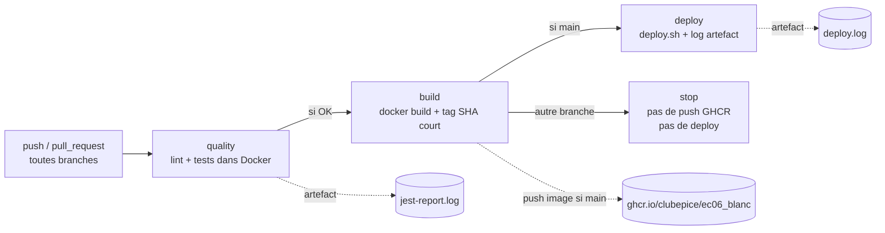

# SkillHub API — EC06 Blanc (CI/CD avec GitHub Actions et Docker)


Mini API Express (Node.js 20) conteneurisée, livrée avec une chaîne CI/CD complète (GitHub Actions + Docker + GHCR).

**Dépôt public :** https://github.com/ClubEpice/EC06_blanc

---

## Section 1 — Workflow Git et Docker

### Stratégie de branches (GitFlow simplifié)

| Branche          | Rôle                                                            |
| ---------------- | --------------------------------------------------------------- |
| `main`           | code stable, déclenche le job `deploy` (production simulée)     |
| `develop`        | branche d'intégration des features avant fusion sur `main`      |
| `feature/<nom>`  | travaux en cours, éphémères, supprimées après merge de la PR    |

**Justification :** ce modèle isole la production (`main`) du flux de développement (`develop`), tout en gardant les branches `feature/*` courtes et focalisées. La CI s'exécute sur **toutes les branches** (lint + tests + build), mais le job `deploy` n'est déclenché **que sur `main`** : on garantit ainsi qu'aucune branche de travail ne peut déclencher un déploiement.

**Protection de la branche `main` (ruleset GitHub)** :
- Push direct sur `main` interdit — **toute modification passe par une Pull Request**.
- **Statuts requis avant merge** : les jobs `quality` et `build` doivent passer au vert.
- Pas de review obligatoire : épreuve individuelle, contributeur unique — la CI verte joue le rôle de garde-fou à la place d'un relecteur humain.

Deux PR ont été ouvertes et fusionnées pendant l'épreuve :
- **PR #1** `feature/dockerfile` → `develop` : ajout du Dockerfile multistage et du docker-compose.
- **PR #2** `feat/ci-pipeline` → `develop` puis `main` : ajout du workflow GitHub Actions.

### Dockerfile multistage

Le [Dockerfile](Dockerfile) suit un pattern **builder + runtime** :

- **Étape 1 — `builder`** (`node:20-alpine`) : installe toutes les dépendances (`pnpm install --frozen-lockfile`, devDeps incluses pour permettre lint + tests dans la même image en CI), copie le code source.
- **Étape 2 — image finale** (`node:20-alpine`) : ne reprend que `node_modules`, `src/`, `tests/`, la config ESLint et `package.json`.
- **Utilisateur non-root** : `USER node` (utilisateur fourni par l'image officielle Node).
- **`EXPOSE 3000`** : port applicatif déclaré.
- **`HEALTHCHECK`** : appelle `GET /health` toutes les 30 s via `wget`.
- **Image finale légère** : basée sur `alpine`, sans devDeps réinstallées dans la couche finale (héritées du builder).

### docker-compose.yml et lancement local

Le [docker-compose.yml](docker-compose.yml) orchestre deux services :

- **`app`** : built localement depuis le `Dockerfile`, expose le port `3000`, charge les variables depuis `.env`.
- **`db`** : `postgres:16-alpine`, volume nommé `db_data` pour la persistance, healthcheck `pg_isready`.
- **`app` dépend de `db`** via `depends_on: condition: service_healthy` — l'API ne démarre qu'une fois la base prête.

```bash
cp .env.dist .env             # renseigner POSTGRES_USER / PASSWORD / DB
docker compose up --build     # build + démarrage
curl http://localhost:3000/health
```

---

## Section 2 — Architecture du pipeline CI/CD

Le workflow [.github/workflows/ci.yml](.github/workflows/ci.yml) se déclenche sur **chaque push** et sur **chaque pull_request**. Il enchaîne trois jobs séquentiels avec garde-fous sur la branche.



### Détail des jobs

**Job `quality`** — lint + tests dans Docker (pas sur le runner) :
1. Génère un `.env` à partir des GitHub Secrets (jamais commit).
2. `docker compose run --rm app pnpm run lint`
3. `docker compose run --rm app pnpm test | tee jest-report.log`
4. Publie `jest-report.log` comme artefact (`if: always()` pour le récupérer même en échec).

**Job `build`** — construction de l'image (dépend de `quality`) :
- `docker/setup-buildx-action` + `docker/build-push-action` avec cache `type=gha`.
- Tags générés via `docker/metadata-action` : `type=sha,format=short` (SHA court tronqué), `type=ref,event=branch`, et `latest` uniquement sur `main`.
- **Login GHCR conditionnel** : `if: github.ref == 'refs/heads/main'`.
- **Push GHCR uniquement sur `main`** : `push: ${{ github.ref == 'refs/heads/main' }}` — les autres branches construisent l'image localement pour valider le build, sans la publier.

**Job `deploy`** — déploiement simulé (dépend de `build`, **uniquement sur `main`**) :
- Exécute [deploy.sh](deploy.sh) qui affiche les commandes Docker qu'un vrai déploiement exécuterait (`docker pull`, `stop`, `run`) et écrit le tout dans `deploy.log`.
- Le tag de l'image est passé via `IMAGE_TAG` (sortie du job `build`).
- Publie `deploy.log` comme artefact.

### Bonus mis en place

- Cache des dépendances Docker via `cache-from: type=gha` / `cache-to: type=gha,mode=max`.
- Push de l'image vers **GitHub Container Registry** (`ghcr.io/clubepice/ec06_blanc`) sur `main`.
- Badge de statut CI dans le README.
- Trigger `pull_request` en plus du `push`.

---

## Section 3 — Gestion des secrets

### Liste des secrets GitHub utilisés

| Nom du secret       | Utilisé dans                                  |
| ------------------- | --------------------------------------------- |
| `POSTGRES_USER`     | génération `.env` du job `quality` → compose  |
| `POSTGRES_PASSWORD` | génération `.env` du job `quality` → compose  |
| `POSTGRES_DB`       | génération `.env` du job `quality` → compose  |
| `GITHUB_TOKEN`      | fourni automatiquement, login GHCR (push image sur `main`) |

Définis dans **Settings → Secrets and variables → Actions** du dépôt GitHub.

### Injection dans la CI

Les secrets ne sont **jamais écrits en clair** dans le code ni dans `ci.yml`. Ils sont référencés via `${{ secrets.NOM }}` et utilisés dans une étape qui génère un `.env` à la volée, lui-même consommé par `docker compose` via `env_file: .env` :

```yaml
- name: Générer le fichier .env depuis les secrets
  run: |
    cat > .env <<EOF
    POSTGRES_USER=${{ secrets.POSTGRES_USER }}
    POSTGRES_PASSWORD=${{ secrets.POSTGRES_PASSWORD }}
    POSTGRES_DB=${{ secrets.POSTGRES_DB }}
    DB_URL=postgres://${{ secrets.POSTGRES_USER }}:${{ secrets.POSTGRES_PASSWORD }}@db:5432/${{ secrets.POSTGRES_DB }}
    EOF
```

GitHub masque automatiquement les valeurs dans les logs (`***`). Aucun `echo` direct n'est effectué sur un secret.

### Confirmation que `.env` n'est pas versionné

- `.env` figure dans [.gitignore](.gitignore) (ligne `.env`).
- `.env` figure également dans [.dockerignore](.dockerignore) pour ne pas fuiter dans une éventuelle build context.
- Seul `.env.dist` est versionné, **avec les clés mais sans valeurs**.
- Vérification : `git ls-files .env` retourne vide.

---

## Section 4 — Instructions et limites

### Démarrer le projet en local

```bash
git clone https://github.com/ClubEpice/EC06_blanc.git
cd EC06_blanc/EC06/EC06_app
cp .env.dist .env
# Renseigner manuellement POSTGRES_USER / POSTGRES_PASSWORD / POSTGRES_DB / DB_URL
docker compose up --build
```

L'API est ensuite disponible sur :
- `http://localhost:3000/` — message d'accueil
- `http://localhost:3000/health` — statut JSON

Pour lancer le lint et les tests comme en CI :

```bash
docker compose run --rm app pnpm run lint
docker compose run --rm app pnpm test
```

### Ce qui n'a pas été fait (limites)

- **Pas de déploiement réel** : le job `deploy` reste simulé via `deploy.sh` (bonus PaaS / SSH non tenté, faute de compte gratuit configurable dans le temps imparti).
- **Pas de scan de vulnérabilités** sur l'image (Trivy / `docker scout`) — pourrait être ajouté en bonus dans le job `build`.
- **Pas de review humaine obligatoire** sur la `main` : seul contributeur sur l'épreuve, la review code-à-code est remplacée par les statuts CI bloquants (`quality` + `build`).
- **Le service `db` n'est pas réellement utilisé par l'API** : l'app ==actuelle== expose juste `/health` sans persistance. La base est présente pour valider l'orchestration compose et la gestion des secrets, conformément à l'énoncé.

### Améliorations futures envisageables

1. **Déploiement réel** sur Fly.io ou Render : ajouter un secret `FLY_API_TOKEN` et remplacer `deploy.sh` par `flyctl deploy`.
2. **Scan d'image** : étape `aquasecurity/trivy-action` dans le job `build`, fail si CVE HIGH/CRITICAL.
3. **Versionnement sémantique** : tags `v1.0.0` automatiques via `release-please` ou `semantic-release`.
4. **Tests d'intégration** contre la base PostgreSQL réelle dans un service `services: postgres` du job `quality`.
5. **Image finale encore plus légère** : passer à `node:20-alpine` distroless ou utiliser `npm prune --production` après build pour retirer les devDeps de l'image finale.
